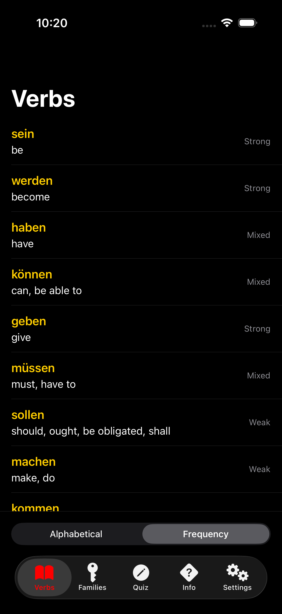
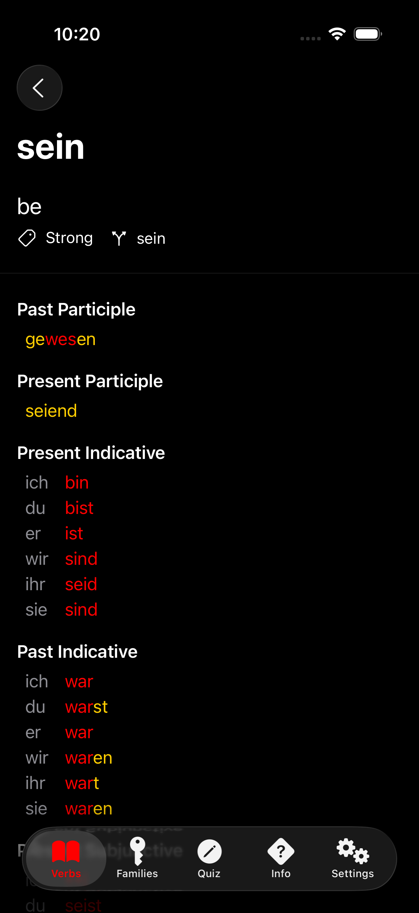
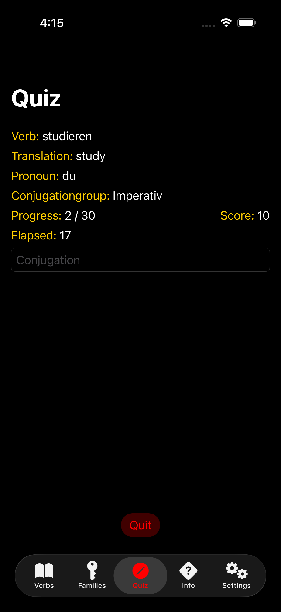
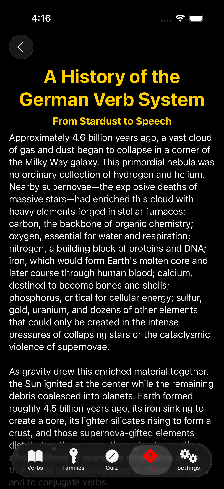
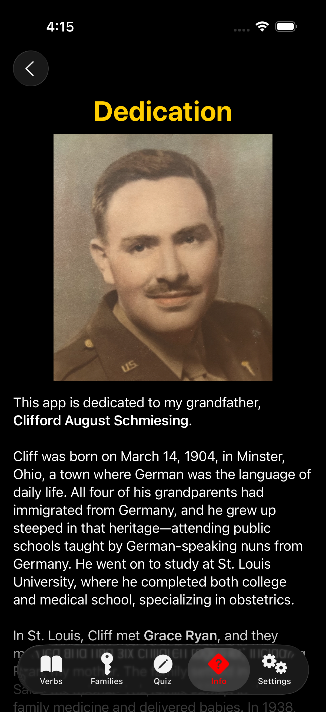

Konjugieren
=========

| App Icon 1 | App Icon 2 | App Icon 3 |
| --- | --- | --- |
|  |  |  |

**Konjugieren** is an under-development iOS™ app for learning German-verb conjugations. **Konjugieren** conjugates 988 verbs—strong, weak, and mixed—in _all_ German [conjugationgroups](https://www.linkedin.com/posts/racecondition_i-have-written-elsewhere-about-how-my-experience-activity-7404189320758280192-tiAL).

**Konjugieren** shares features with its French-verb and Spanish-verb predecessors, [Conjuguer](https://apps.apple.com/us/app/conjuguer/id1588624373) and [Conjugar](https://itunes.apple.com/us/app/conjugar/id1236500467?mt=8). The big difference with **Konjugieren** is that Josh Adams is developing the app using [Claude Code](https://www.youtube.com/watch?v=AJpK3YTTKZ4). He could have written every line manually, but Claude Code is a massive time-saver, which is important, given the paucity of free time.

### Screenshots

| Verb List | Verb | Quiz |
| --- | --- | --- |
|  |  |  |

| Verb History | Dedication |
| --- | --- |
|  |  |

### License

**Konjugieren** is licensed under the GNU General Public License in order to discourage release of low-quality clones to the App Store™.
