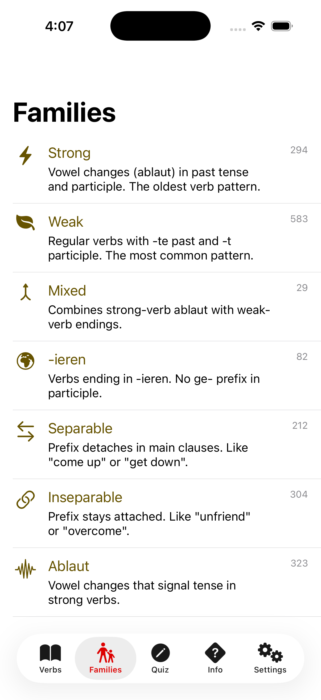
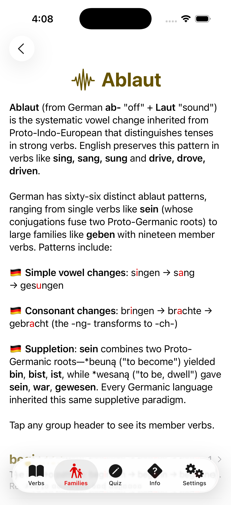

Konjugieren
=========


| App Icon 1 | App Icon 2 | App Icon 3 |
| --- | --- | --- |
|  |  |  |

**Konjugieren** is an iOS app for learning German-verb conjugations. It conjugates 988 verbs—strong, weak, mixed, and _-ieren_—across all 14 German [conjugationgroups](https://www.linkedin.com/posts/racecondition_i-have-written-elsewhere-about-how-my-experience-activity-7404189320758280192-tiAL), from Präsens Indikativ to Plusquamperfekt Konjunktiv II. The app is fully localized in English and German.

Under the hood, **Konjugieren** features a domain-specific ablaut engine that models the vowel and consonant changes of German strong verbs, a hand-written rich-text parser, protocol-oriented dependency injection, and a comprehensive [Swift Testing](https://developer.apple.com/xcode/swift-testing/) suite with 82 tests across 1,700+ lines.

### Screenshots

| Verb List | Verb | Quiz | Family List |
| --- | --- | --- | --- |
|  |  |  |  |

| Family | Info List | Verb History | Dedication |
| --- | --- | --- | --- |
|  |  |  |  |

### Why Konjugieren?

Josh Adams created **Konjugieren** as a tribute to his grandfather, [Clifford August Schmiesing](https://www.findagrave.com/memorial/56382498/clifford-august-schmiesing) (1904–1944), an Army doctor who grew up speaking German in Minster, Ohio and died serving in World War II. The app's dedication tells his story.

**Konjugieren** is also an experiment in human-AI collaboration. Josh is developing the entire app with [Claude Code](https://www.youtube.com/watch?v=AJpK3YTTKZ4)—not as a crutch, but as a deliberate productivity multiplier. He spent twelve months on [Conjuguer](https://apps.apple.com/us/app/conjuguer/id1588624373) (French) and nine months on [Conjugar](https://itunes.apple.com/us/app/conjugar/id1236500467?mt=8) (Spanish). With Claude Code, **Konjugieren** reached feature parity in six weeks—and then surpassed both predecessors with features they lack: onboarding, visually distinctive icons for each verb, variable search scope, and a 3,000-word history of the German language from the formation of the Solar System.

### Architecture

**Protocol-oriented dependency injection** — [`World.swift`](Konjugieren/Models/World.swift) is a lightweight DI container that injects four dependencies (`Settings`, `GameCenter`, `SoundPlayer`, `FatalError`), each defined as a protocol with Real, Dummy, Spy, or Fake implementations. This enables full testability with zero third-party frameworks: production code crashes early on invalid data via `FatalErrorReal`, while tests capture those errors with `FatalErrorSpy`.

**Ablaut engine** — German strong verbs undergo vowel and consonant changes (_ablaut_) that differ by conjugationgroup. The engine uses region-based substring replacement: each verb's [XML definition](Konjugieren/Models/Verbs.xml) marks the mutable region with `^` delimiters, and [ablaut-group definitions](Konjugieren/Models/AblautGroups.xml) (66 patterns) specify replacements per conjugationgroup. A full-override syntax (`*` suffix) handles highly irregular verbs like _sein_ and _haben_. [`Conjugator.swift`](Konjugieren/Models/Conjugator.swift) applies these rules at runtime.

**Rich-text parser** — A [hand-written state machine](Konjugieren/Utils/StringExtensions.swift) parses four markup syntaxes (backtick headings, tilde bold, dollar-sign ablaut highlighting, percent-delimited URLs) into a recursive `RichTextBlock`/`TextSegment` enum AST, rendered by [`RichTextView.swift`](Konjugieren/Views/RichTextView.swift). This powers the app's 3,000-word bilingual essay on German-verb history.

**@Observable reactive state** — The app uses Swift's modern [Observation](https://developer.apple.com/documentation/observation) framework throughout (`@Observable` on `World`, `Quiz`, `Settings`), with no Combine or third-party reactive dependencies.

### Technology Stack

- **SwiftUI** — Declarative UI with custom `ViewModifier`s and `TabView` navigation
- **Swift Testing** — Modern test framework (`@Test`, `#expect`) with 82 test functions
- **Game Center** — Global leaderboard for quiz scores via `GKAccessPoint`
- **XMLParser** — Streaming parser for verb and ablaut-group data (988 verbs, 66 patterns)
- **Custom URL scheme** — `konjugieren://` deeplinks for inter-article and verb navigation
- **Localization** — Full EN/DE support via `.xcstrings` string catalogs

### Testing

The test suite spans **1,700+ lines** across four files, with **82 test functions** covering conjugation logic, quiz state management, rich-text parsing, and time formatting.

The conjugation tests use a **mixed-case convention** to verify ablaut highlighting: lowercase letters represent unchanged portions, and UPPERCASE letters mark ablaut-changed regions. For example, `"sAng"` asserts that _singen_'s Präteritum changes "i" to "a" and the UI will highlight that change. This convention makes it immediately visible when a test expectation involves an ablaut transformation.

Crash-early validation in the XML parsers is tested via `FatalErrorSpy`, which captures error messages that would be `fatalError` calls in production. This ensures developer-controlled data files are validated without allowing silent corruption.

### Getting Started

```bash
git clone https://github.com/vermont42/Konjugieren.git
cd Konjugieren
open Konjugieren.xcodeproj
```

Select the **Konjugieren** scheme, choose an iOS 26 simulator, and build (Cmd-B). To run tests:

```bash
xcodebuild -project Konjugieren.xcodeproj -scheme Konjugieren \
  -destination 'platform=iOS Simulator,name=iPhone 17' \
  -parallel-testing-enabled NO test
```

### Related Projects

- [**Conjuguer**](https://apps.apple.com/us/app/conjuguer/id1588624373) — French-verb conjugation app (iOS)
- [**Conjugar**](https://itunes.apple.com/us/app/conjugar/id1236500467?mt=8) — Spanish-verb conjugation app (iOS)
- [**racecondition.software**](https://racecondition.software) — Josh's development blog

### License

**Konjugieren** is licensed under the [GNU General Public License v3.0](LICENSE) in order to discourage release of low-quality clones to the App Store™.
