Konjugieren
=========


| App Icon 1 | App Icon 2 | App Icon 3 |
| --- | --- | --- |
|  |  |  |

**Konjugieren** is an iOS app for learning German-verb conjugations. It conjugates 990 verbs—strong, weak, mixed, and _-ieren_—across all 14 German [conjugationgroups](https://www.linkedin.com/posts/racecondition_i-have-written-elsewhere-about-how-my-experience-activity-7404189320758280192-tiAL), from Präsens Indikativ to Plusquamperfekt Konjunktiv II. The app is fully localized in English and German.

Under the hood, **Konjugieren** features a domain-specific ablaut engine that models the vowel and consonant changes of German strong verbs, a hand-written rich-text parser, protocol-oriented dependency injection, and a comprehensive [Swift Testing](https://developer.apple.com/xcode/swift-testing/) suite with 113 tests across 1,800+ lines.

**Konjugieren** is available for free download in the iOS App Store™. Tap the button below to install.

[](https://apps.apple.com/us/app/konjugieren/id6758258747)

### Screenshots

| Verb List | Verb | Quiz | Family List |
| --- | --- | --- | --- |
| 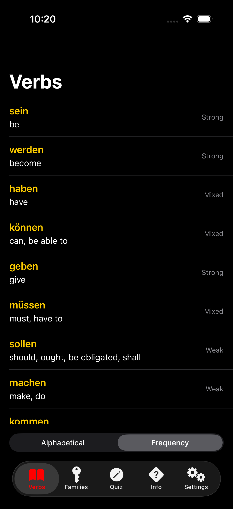 | 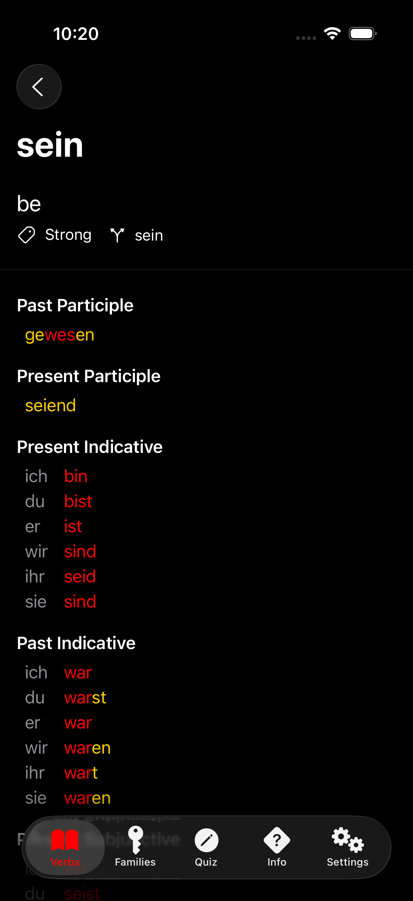 | 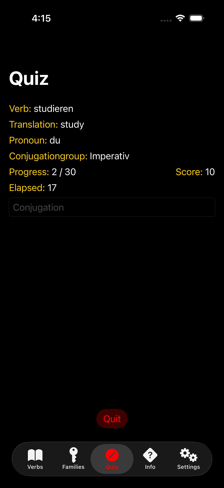 | 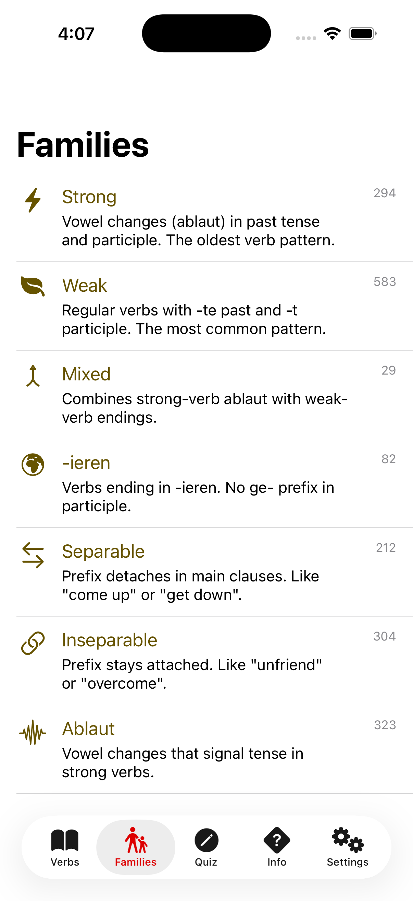 |

| Family | Info List | Verb History | Dedication |
| --- | --- | --- | --- |
| 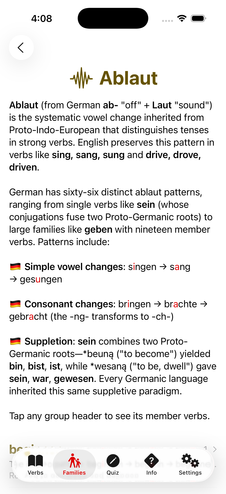 | 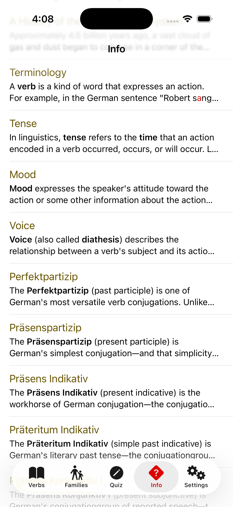 | 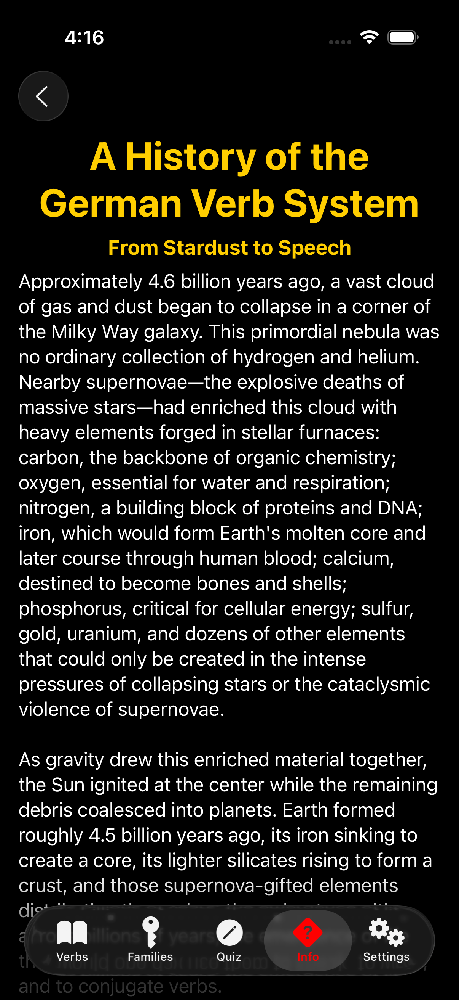 | 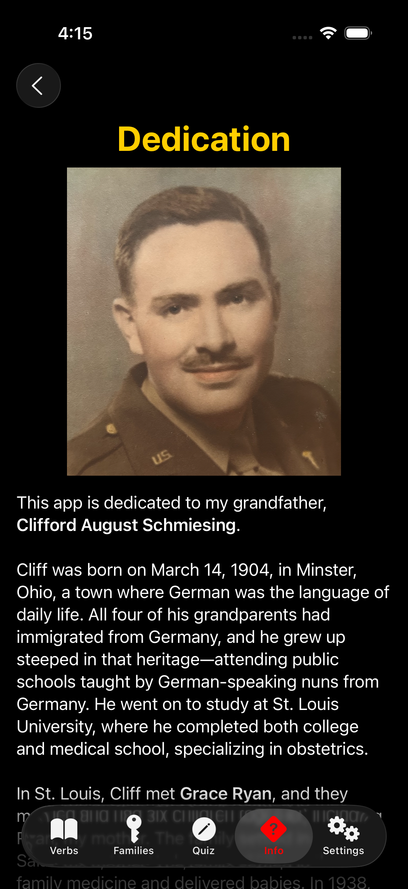 |

| Etymology/Use | Widgets | Arcade Game | Conjugation Tutor |
| --- | --- | --- | --- |
| 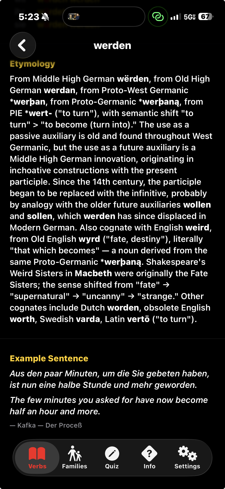 | 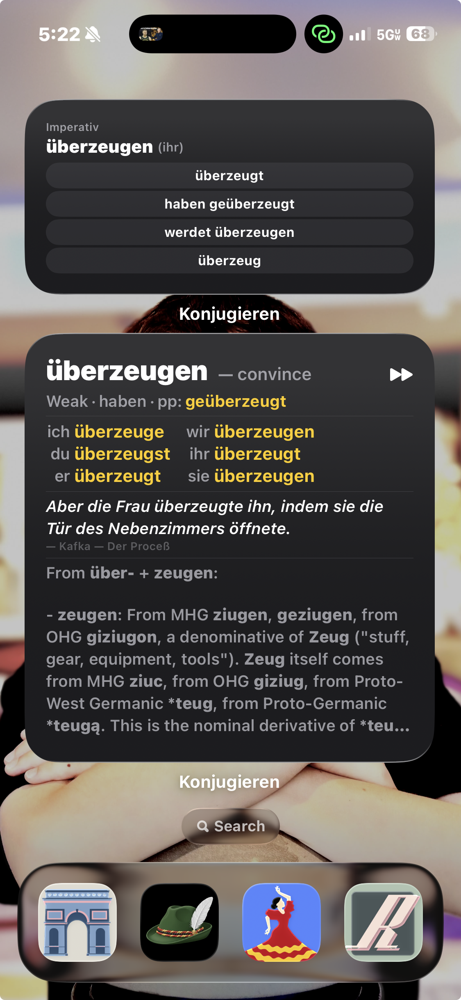 | 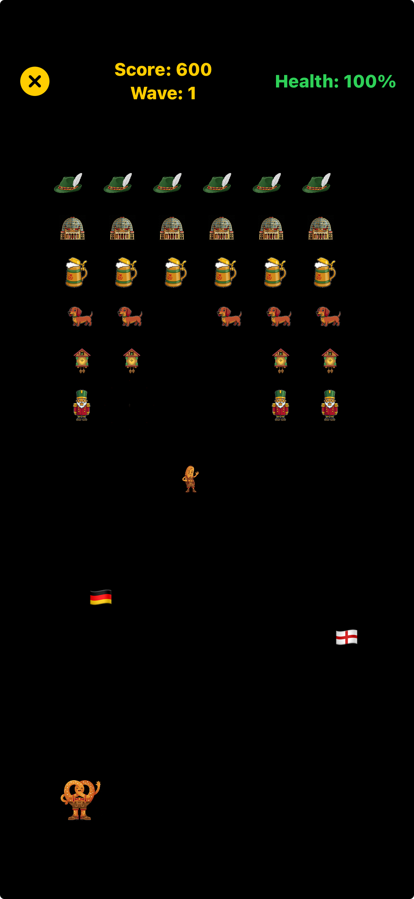 | 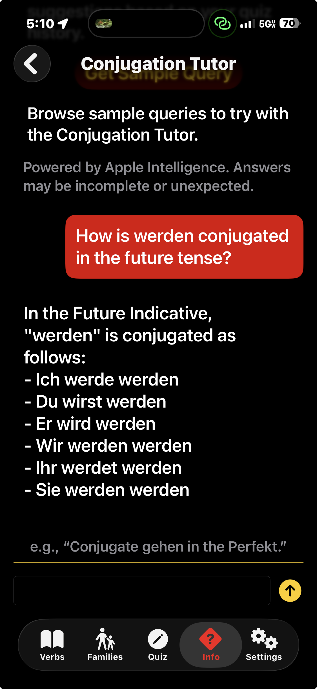 |

### Why Konjugieren?

Josh Adams created **Konjugieren** as a tribute to his grandfather, [Clifford August Schmiesing](https://www.findagrave.com/memorial/56382498/clifford-august-schmiesing) (1904–1944), an Army doctor who grew up speaking German in Minster, Ohio and died serving in World War II. The app's dedication tells his story.

**Konjugieren** is also an experiment in human-AI collaboration. Josh is developing the entire app with [Claude Code](https://www.youtube.com/watch?v=AJpK3YTTKZ4)—not as a crutch, but as a deliberate productivity multiplier. He spent twelve months on [Conjuguer](https://apps.apple.com/us/app/conjuguer/id1588624373) (French) and nine months on [Conjugar](https://itunes.apple.com/us/app/conjugar/id1236500467?mt=8) (Spanish). With Claude Code, **Konjugieren** reached feature parity in six weeks—and then surpassed both predecessors with features they lack: onboarding, visually distinctive icons for each verb, variable search scope, and a 3,000-word history of the German language from the formation of the Solar System to today.

The collaboration goes beyond speed. Claude Code added TelemetryDeck analytics in a single pass, but Josh then directed two successive architectural refinements: first, wrapping the SDK behind an `Analytics` protocol with Real and Spy implementations—extending the app's existing dependency-injection pattern—and second, replacing stringly typed signal names with a compiler-checked `AnalyticsName` enum. A coding assistant executes quickly, but an experienced developer knows _what_ to ask for.

### Architecture

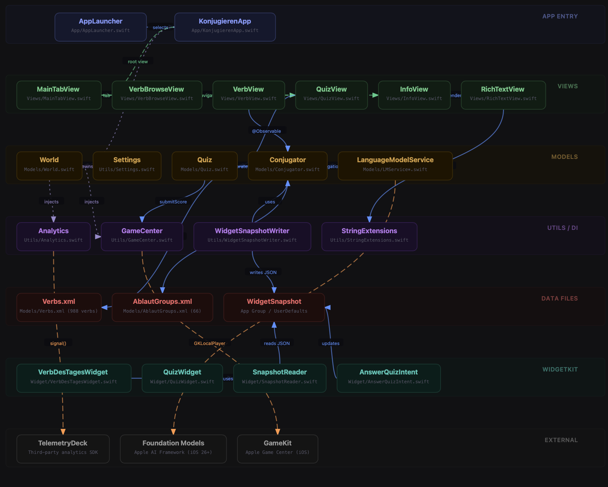

*Five layers — App Entry, Views, Models, Data, and Infrastructure — connected by four relationship types: data flow (solid blue), navigation (dashed green), dependency injection (dotted gray), and cross-cutting concerns (dashed orange). The Conjugator engine sits at the center of the Models layer, fed by Verb and AblautGroup data from XML, and providing conjugation results upward to VerbView and the Quiz system.*

**Protocol-oriented dependency injection** — [`World.swift`](Konjugieren/Models/World.swift) is a lightweight DI container that injects six dependencies (`Settings`, `GameCenter`, `SoundPlayer`, `Utterer`, `FatalError`, `Analytics`), each defined as a protocol with Real, Dummy, Spy, or Fake implementations. This enables full testability with zero third-party frameworks: production code crashes early on invalid data via `FatalErrorReal`, while tests capture those errors with `FatalErrorSpy`.

**Ablaut engine** — German strong verbs undergo vowel and consonant changes (_ablaut_) that differ by conjugationgroup. The engine uses region-based substring replacement: each verb's [XML definition](Konjugieren/Models/Verbs.xml) marks the mutable region with `^` delimiters, and [ablaut-group definitions](Konjugieren/Models/AblautGroups.xml) (66 patterns) specify replacements per conjugationgroup. A full-override syntax (`*` suffix) handles highly irregular verbs like _sein_ and _haben_. [`Conjugator.swift`](Konjugieren/Models/Conjugator.swift) applies these rules at runtime.

**Rich-text parser** — A [hand-written state machine](Konjugieren/Utils/StringExtensions.swift) parses four markup syntaxes (backtick headings, tilde bold, dollar-sign ablaut highlighting, percent-delimited URLs) into a recursive `RichTextBlock`/`TextSegment` enum AST, rendered by [`RichTextView.swift`](Konjugieren/Views/RichTextView.swift). This powers the app's 3,000-word bilingual essay on German-verb history.

**@Observable reactive state** — The app uses Swift's modern [Observation](https://developer.apple.com/documentation/observation) framework throughout (`@Observable` on `World`, `Quiz`, `Settings`), with no Combine or third-party reactive dependencies.

**Conjugation Tutor (Apple Intelligence)** — An on-device conversational tutor powered by Apple's [Foundation Models](https://developer.apple.com/documentation/foundationmodels) framework. The [`LanguageModelService`](Konjugieren/Models/LanguageModelService.swift) protocol abstracts the AI layer behind the same DI pattern as the rest of the app, with [`LanguageModelServiceReal`](Konjugieren/Models/LanguageModelServiceReal.swift) running on iOS 26+ and a [`LanguageModelServiceDummy`](Konjugieren/Models/LanguageModelServiceDummy.swift) keeping the app functional on older devices. The real implementation manages a stateful `LanguageModelSession` and exposes three capabilities: interactive chat, quiz-error explanation, and personalized practice recommendations.

The centerpiece is [`ConjugationTool`](Konjugieren/Models/LanguageModelServiceReal.swift), a Foundation Models `Tool` conformance that lets the on-device model look up real conjugations from the app's 988-verb engine instead of hallucinating them. The tool's `@Generable` schema was iteratively refined across 10+ rounds (documented in [`on-device-tool-design.md`](docs/on-device-tool-design.md)) to minimize what the model must decide: the model specifies only a verb and conjugationgroup; the tool handles all six grammatical persons in a single call, parses both German and English conjugationgroup names with ordered-specificity fuzzy matching, and strips ablaut markup from the output. A call-count circuit breaker (max 3 retries per message, 15 per session) prevents infinite tool-call loops. The retry system detects 15+ refusal patterns and recreates the session on failure.

[`QuizErrorHistory`](Konjugieren/Models/QuizErrorHistory.swift) aggregates the user's quiz mistakes by conjugationgroup, and the tutor's practice-recommendation engine feeds this data to the model to surface the user's weakest areas. [`TutorChatHistory`](Konjugieren/Models/TutorChatHistory.swift) persists conversations to UserDefaults with a 200-message ring buffer, so context survives app restarts.

**Retro arcade game (pure SwiftUI)** — A German-themed arcade shooter built entirely with SwiftUI and Core Motion—no SpriteKit, no UIKit, no game engine. [`GameState.swift`](Konjugieren/Models/GameState.swift) (1,500 lines) drives a `TimelineView(.animation)` game loop with frame-rate-independent delta-time physics, while `CMMotionManager` at 60 Hz translates device tilt into player movement.

The game manages 11 entity types as value-semantic structs: enemies in a 6×6 grid with parabolic dive-bombing paths, zigzagging animal emoji that drop coins, gravity-affected eggs that hatch into player-seeking hatchlings, bouncing soccer balls with momentum transfer, five-segment bratwurst chains that split when hit and spawn destructible pretzel obstacles, and multi-phase ghosts with a five-state AI (descending → pursuing → fleeing → devoured → exiting). Three special mechanics rotate on a randomized 27-second interval: Fussball, Bratwurstkette, and Geisterstunde (ghost hunt, triggered by shooting a crystal ball).

The collision system handles 21 distinct interaction types with asymmetric behaviors—a soccer ball bounces off enemies but kills them, shields absorb hits but expire, and a portal mechanic teleports the player across the screen to escape hatchling swarms. Infinite waves scale difficulty exponentially (`enemySpeed = 21 × pow(1.02, wave − 1)`), and the final-score formula (`score × (health + 1) − elapsed seconds`) rewards aggressive, high-health play. Three power-up types (health, shield, rapid-fire) drop from defeated enemies at a 15% rate. The game includes 34 sound effects, context-sensitive haptic feedback, and particle-burst death animations—all rendered in SwiftUI with `Canvas` and standard views.

**WidgetKit** — Two widgets share data through an App Group container:

**Verb des Tages** displays the day's verb across five sizes: three home-screen sizes (small, medium, large) and two lock-screen / watchOS-complication sizes (accessoryRectangular, accessoryInline). The small widget shows the infinitive plus ich/sie Präsens conjugations; the medium adds the full six-person paradigm in two columns; the large adds a Perfektpartizip line, example sentence with source attribution, and an etymology snippet (truncated to 450 characters at a sentence boundary, main-verb bullet first). A forward button on all sizes triggers NextVerbIntent to cycle verbs without opening the app.

**Conjugation Quiz** offers small and medium home-screen sizes with a four-option multiple-choice question. Answers are submitted via AnswerQuizIntent — a WidgetKit AppIntent that validates the selection, persists the result to the shared UserDefaults container, and reloads the timeline to show a ✓/✗ result view. Answer options are deterministically shuffled using a SeededRNG (XORShift) keyed on the question ID, ensuring the same ordering survives widget reloads.

**Data pipeline** — [`WidgetSnapshotWriter`](Konjugieren/Utils/WidgetSnapshotWriter.swift) (app side) selects the day's verb with `(daysSinceReference + debugOffset) × 127 % eligibleVerbs.count`, generates all six Präsens conjugations via `Conjugator`, assembles wrong quiz answers deterministically, and writes a `WidgetSnapshot` JSON to the shared App Group container. [`SnapshotReader`](KonjugierenWidget/SnapshotReader.swift) (widget side) reads that file; on failure it falls back silently to a placeholder (gehen). The same mixed-case ablaut highlighting used in the main app — yellow for regular portions, red for ablaut-changed letters — is replicated in `WidgetAblautText.swift` using `AttributedString`, with `@Environment(\.colorScheme)` threaded through to switch between dark-mode gold (#FFCE00) and light-mode olive (#665300).

### Accessibility

Konjugieren is fully accessible to VoiceOver users. The implementation spans five new files and modifications to fourteen existing views, using four distinct accessibility strategies:

**Ablaut-aware accessibility labels** — The app's core pedagogical feature — color-coded ablaut highlighting where `sAng` renders "s" in one color and "A" in another — is invisible to screen readers. [`MixedCaseAccessibility.swift`](Konjugieren/Utils/MixedCaseAccessibility.swift) solves this with a pure function that walks the mixed-case string using the same `isFormalSieStart` algorithm as the visual renderer ([`TextExtension.swift`](Konjugieren/Utils/TextExtension.swift)), collecting uppercase characters as irregular, and producing labels like `"sang, a is irregular"` or `"bin, b i n are irregular"`. The formal pronoun "Sie" is correctly excluded from irregular-letter detection despite its initial capital.

**Speech-synthesis DI** — Quiz questions are spoken aloud using `AVSpeechSynthesizer`, following the same protocol-oriented DI pattern as `SoundPlayer`. The [`Utterer`](Konjugieren/Utils/Utterer.swift) protocol defines `setup()` and `utter(_:localeString:)`, with [`UttererReal`](Konjugieren/Utils/UttererReal.swift) tuning rate (0.5) and pitch (0.8) for clear German speech, and [`UttererDummy`](Konjugieren/Utils/UttererDummy.swift) keeping tests silent. Verb names are spoken in `de-DE`, translations in `en-US` — the locale switch happens mid-question so VoiceOver users hear correct pronunciation for both languages.

**Semantic structure** — Every section heading uses `.accessibilityAddTraits(.isHeader)`, enabling VoiceOver's rotor to jump between sections. The `SubheadingLabel` ViewModifier applies this trait globally, so all views using `.subheadingLabel()` gain heading semantics automatically. Conjugation rows use `.accessibilityElement(children: .combine)` to merge pronoun and verb form into a single element — VoiceOver reads "er sang, a is irregular" instead of "er" ... "sang" as separate swipes.

**Quiz VoiceOver flow** — Three announcement methods in [`Quiz.swift`](Konjugieren/Models/Quiz.swift), all gated on `UIAccessibility.isVoiceOverRunning`: `announceQuestion()` uses `Current.utterer` for locale-aware speech synthesis; `announceAnswerResult()` and `announceQuizCompletion()` use `UIAccessibility.post(notification: .announcement)` for VoiceOver-native feedback. Timing uses `DispatchQueue.main.asyncAfter` to avoid interrupting the screen reader's UI-change announcements. An `@AccessibilityFocusState` binding in [`QuizView.swift`](Konjugieren/Views/QuizView.swift) automatically moves VoiceOver focus to the text field when the quiz advances.

**`CFBundleSpokenName`** — The [`Info.plist`](Konjugieren/Info.plist) key `CFBundleSpokenName` provides VoiceOver with a phonetic pronunciation guide (`"cone you gear en"`) so the app name is spoken correctly in English contexts.

### Technology Stack

- **SwiftUI** — Declarative UI with custom `ViewModifier`s, `TabView` navigation, `TimelineView` game loop, and `Canvas` particle effects
- **Foundation Models** — On-device Apple Intelligence integration with `SystemLanguageModel`, `LanguageModelSession`, `Tool` protocol, and `@Generable` schemas
- **Core Motion** — 60 Hz gyroscope input for arcade-game tilt controls via `CMMotionManager`
- **Swift Testing** — Modern test framework (`@Test`, `#expect`) with 113 test functions
- **Game Center** — Global leaderboard for quiz scores via `GKAccessPoint`
- **WidgetKit** — Two widgets (Verb des Tages, Conjugation Quiz) across five sizes, with AppIntents for interactive quiz answers and verb cycling without launching the app
- **XMLParser** — Streaming parser for verb and ablaut-group data (988 verbs, 66 patterns)
- **Custom URL scheme** — `konjugieren://` deeplinks for inter-article and verb navigation
- **Localization** — Full EN/DE support via `.xcstrings` string catalogs
- **Accessibility** — VoiceOver support with `AVSpeechSynthesizer`, `@AccessibilityFocusState`, `UIAccessibility.post`, and `CFBundleSpokenName`

### Testing

The test suite spans **1,800+ lines** across five files, with **113 test functions** covering conjugation logic, quiz state management, rich-text parsing, and time formatting.

The conjugation tests use a **mixed-case convention** to verify ablaut highlighting: lowercase letters represent unchanged portions, and UPPERCASE letters mark ablaut-changed regions. For example, `"sAng"` asserts that _singen_'s Präteritum changes "i" to "a" and the UI will highlight that change. This convention makes it immediately visible when a test expectation involves an ablaut transformation.

Crash-early validation in the XML parsers is tested via `FatalErrorSpy`, which captures error messages that would be `fatalError` calls in production. This ensures developer-controlled data files are validated without allowing silent corruption.

### Getting Started

```bash
git clone https://github.com/vermont42/Konjugieren.git
cd Konjugieren
open Konjugieren.xcodeproj
```

Select the **Konjugieren** scheme, choose an iOS 26 simulator, and build (Cmd-B). To run tests:

```bash
xcodebuild -project Konjugieren.xcodeproj -scheme Konjugieren \
  -destination 'platform=iOS Simulator,name=iPhone 17' \
  -parallel-testing-enabled NO test
```

When working with [Claude Code](https://www.youtube.com/watch?v=AJpK3YTTKZ4), Konjugieren's `CLAUDE.md` depends on the [`ios-build-verify`](https://github.com/vermont42/ios-build-verify) Claude Code plugin, which Josh developed to address frustrations he experienced building Konjugieren. The plugin bundles `xcodebuild` + `xcbeautify` for builds and `AXe`-driven simulator operations (launch, tap, screenshot, audit) for verification, all behind named scripts driven by a per-project config.

Developers who prefer not to take on the `ios-build-verify` dependency can follow the instructions in [`docs/vanilla_build_and_test.md`](docs/vanilla_build_and_test.md) to replace it with raw `xcodebuild` commands.

### Related Projects

- [**Conjuguer**](https://apps.apple.com/us/app/conjuguer/id1588624373) — French-verb conjugation app (iOS)
- [**Conjugar**](https://itunes.apple.com/us/app/conjugar/id1236500467?mt=8) — Spanish-verb conjugation app (iOS)
- [**racecondition.software**](https://racecondition.software) — Josh's development blog

### License

**Konjugieren** is licensed under the [GNU General Public License v3.0](LICENSE) in order to discourage release of low-quality clones to the App Store™.
